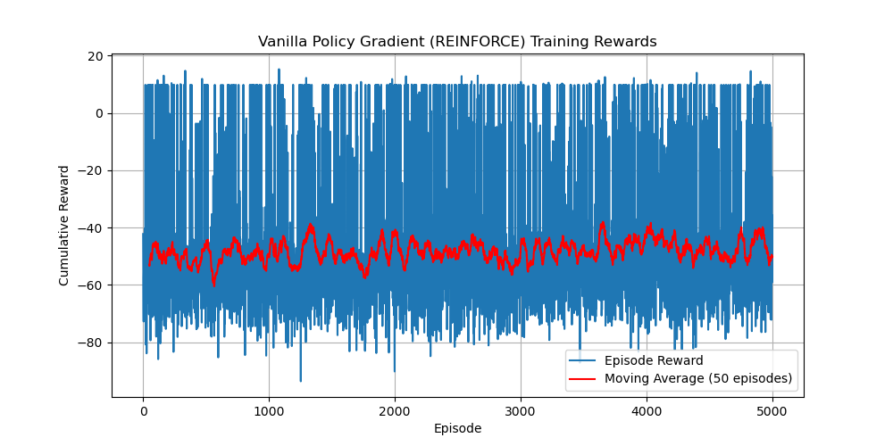

# CMPE591 - Homework 3

## Results Overview

The figure below shows the cumulative reward per episode (blue line) and a 50-episode moving average (red line) over 5,000 episodes of training:

Because of hardware constraints, the computer used for these experiments could not handle running 10,000 episodes in a reasonable amount of time, so training was limited to 5,000 episodes.
