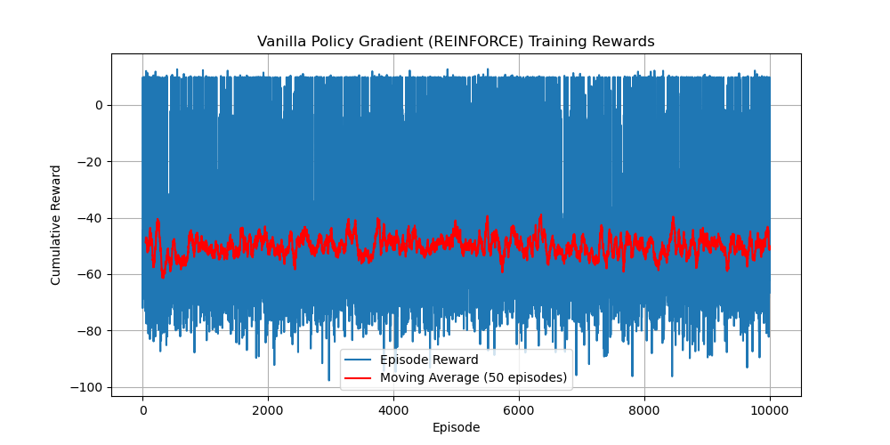

# CMPE591 - Homework 3

## Results Overview

The figure below shows the cumulative reward per episode over 10,000 episodes of training:

The figure below shows the cumulative reward per episode and a 50-episode moving average (red line) over 5,000 episodes of training:

